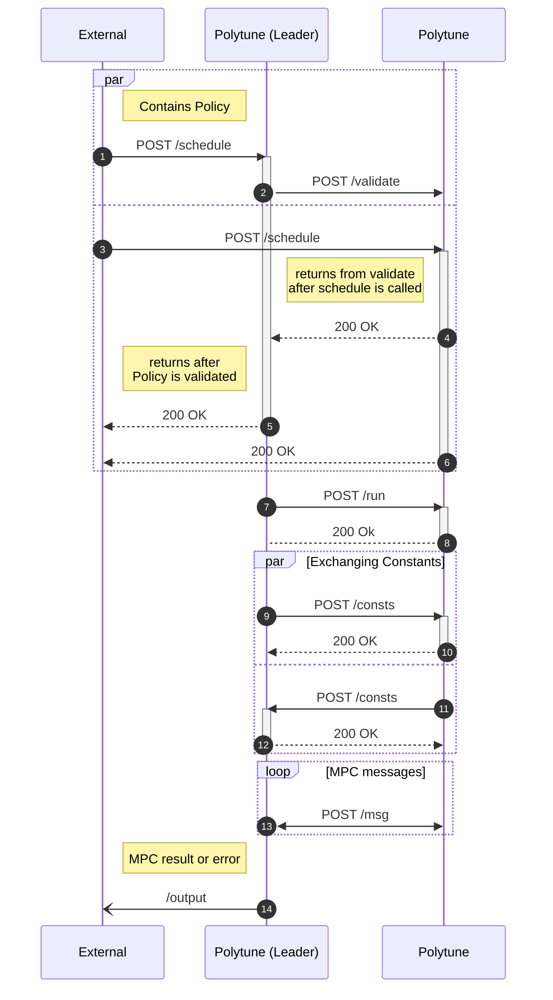

# Polytune HTTP Server

This crate implements a full-fledged MPC server which can receive requests containing a program specified as a Garble program, coordinate with multiple instances of this server, execute the provided program securely using Polytune, and return the result.

The MPC program as well as any configuration necessary is specified using a JSON configuration that is provided via an API call to the `polytune-http-server`.

> [!CAUTION]
> Currently, the Polytune HTTP server does not perform authentication of the communication between the parties. If you want to deploy Polytune in an environment where untrusted requests can be sent to the server, you need to implement your own server atop the server-core, or proxy the communication between Polytune using something like mTLS for mutual authentication. 

## How to Deploy the Engine

The following example shows how to deploy the MPC engine for two parties. If you want to deploy the engine with more parties or a different Garble program, the same principles apply.

A simple [Dockerfile](./Dockerfile) is provided as an example of how to run the MPC engine inside a docker container. This image is built in CI and pushed to [ghcr.io/sine-fdn/polytune/polytune-http-server](ghcr.io/sine-fdn/polytune/polytune-http-server).

To build and run the container, use the following commands and **make sure to run them from the top level directory of the repository**:

```
docker build -f crates/polytune-http-server/Dockerfile --tag 'polytune-http-server' .
docker run -t -p 8000:8000 polytune-http-server
```

Starting the container does not immediately start an MPC execution, this needs to be explicitly triggered with a POST request to `localhost:8000/schedule` while providing the necessary configuration file (see `./policies/` example configs) as a JSON body.

The `"input"` part of the JSON needs to use Garble's serialization format, as described in the [Garble Serialization How-To](https://garble-lang.org/serde.html). The result of the MPC execution will use the same serialization format and is sent to the endpoint specified as `"output"` in the JSON.

**Please note that a call to `/schedule` only returns once it has been called for all parties with the same computation ID.**

Make sure to change the `"participants"` key in the configuration files (in our example case `policy0.json` and `policy1.json`) to the addresses used by the parties. The first address in the array is always the first party, the second address in the array the second party and so on.

Let's assume that party 0 is listening at `http://1.2.3.4:8000` and party 1 at `http://5.6.7.8:9000`. The configuration files `policy0.json` and `policy1.json` would then both need to contain:

```json
{
  "participants": ["http://1.2.3.4:8000", "http://5.6.7.8:9000"],
  ...
}
```

## Configuration

The polytune server can be configured via its CLI arguments (use `--help` to see the valid arguments) or via ENV variables when deployed as a Docker container.
```
Logging can be controlled with an EnvFilter via the `POLYTUNE_LOG` environment variable.

Usage: polytune-http-server [OPTIONS]

Options:
  -a, --addr <ADDR>
          The socket address to bind the server to
          
          [env: POLYTUNE_ADDR=]
          [default: 0.0.0.0:8000]

      --concurrency <CONCURRENCY>
          Number of concurrent policy evaluations this party can be the leader of
          
          This limits how many policy evaluations this instance can be the the leader of at the same time. It does not limit the total number of concurrent evaluations.
          
          [env: POLYTUNE_CONCURRENCY=]
          [default: 2]

      --tmp-dir <TMP_DIR>
          Directory to store temporary files to reduce memory consumption. Should not be on a tmpfs
          
          Polytune will create temporary files in this directory to store intermediate values. This reduces the peak memory consumption significantly. Make sure that the directory is not on a tmpfs filesystem (as /tmp usually is), as these files will be stored in memory, negating the memory benefit.
          
          [env: POLYTUNE_TMP_DIR=]

      --jwt-key <JWT_KEY>
          Path to PEM file with an ECDSA key in PKCS#8 form for creating JWTs that are added to requests
          
          Note that these JWTs are intended to be checked by a proxy between the Polytune instances. Polytune does not itself verify the JWTs of requests it receives.
          
          [env: POLYTUNE_JWT_KEY=]

      --jwt-iss <JWT_ISS>
          The JWT `iss` claim to use for signed JWTs
          
          [env: POLYTUNE_JWT_ISS=]
          [default: polytune]

      --jwt-exp <JWT_EXP>
          The JWT `exp` expiry in seconds from creation claim to use for signed JWTs
          
          [env: POLYTUNE_JWT_EXP=]
          [default: 300]

      --jwt-claims <JWT_CLAIMS>
          Additional claims to add to the signed JWTs. Needs to be a json object
          
          If this is set, --jwt-key is required.
          
          Examples:
          
          POLYTUNE_JWT_CLAIMS='{"roles": ["TEST_ROLE"]}' polytune-http-server
          
          [env: POLYTUNE_JWT_CLAIMS=]
```

## OpenAPI Spec

The server provides an OpenAPI spec at `/api.json` and a Swagger UI for the spec at `/swagger`.

## Logging

The logging output of the server can be configured using the `POLYTUNE_LOG` environment variable using an [`EnvFilter` directive](https://docs.rs/tracing-subscriber/latest/tracing_subscriber/filter/struct.EnvFilter.html).

## Concurrency and Memory Consumption

Polytune HTTP server exposes a `concurrency` parameter, that controls how many concurrent policy evaluations this instance can be the leader of. This parameter needs to be tuned based on available RAM the server is running on and the Garble programs that are executed. To help estimate the memory needs of the service and the concurrency value, Polytune will print its current memory consumption regularly as a debug message. To view this message, set the `POLYTUNE_LOG` env variable to `debug` (this displays all debug variables) or to `polytune_http_server::memory_tracking=debug` to just receive memory tracking messages. This memory tracking is only available on the `x86_64-unknown-linux-gnu` target, i.e. `x86_64` architecture on Linux with glibc. If you're using the provided docker image, this is enabled.


## Request Diagram

The below diagram shows the requests involved in scheduling and executing an MPC computation using the Polytune HTTP server. In this example, we have some external entity that schedules a [`Policy`] on two Polytune instances. The leader instance is specified in the Policy itself, and not an inherent property of the Polytune instance. You can have an instance that simultaneously executes one Policy as the leader, and another one as a contributor.  
Note that a request to `/schedule` only returns once the [`Policy`] has been validated and the instances agree on what to compute. The validation checks that the program and the specified leader is equal in the policies sent to the party. Notably, it does not check whether the participants list is equal. This can be useful if the URL that an instance `i` is reachable at is different for instances `x` and `y`.  
The exchanging of constants specified in the policies happens in parallel between all parties. Afterwards, the actual MPC protocol is executed. The messages sent by the Polytune [`Channel`] implementation are transmitted via requests to the `/msg` route.  
If an error happens during the constants exchanging or MPC evaluation, the error will be sent to the URl specified in the `output` field of the Policy, if present. Otherwise, the result as a serialized Garble [`Literal`] is sent to the output.



### Why HTTP?
HTTP was chosen as the transport protocol for this version of the Polytune server as this was required by a deployment we worked on, where the HTTP traffic was proxied by a separate component and secured using mutual TLS. As part of [[#209](https://github.com/sine-fdn/polytune/issues/209)], we will likely implement a Polytune server using QUIC as the transport protocol.


[`Policy`]: https://github.com/sine-fdn/polytune/tree/http-server/additional-docs/crates/polytune-http-server
[`Channel`]: https://docs.rs/polytune/latest/polytune/channel/trait.Channel.html
[`Literal`]: https://docs.rs/garble_lang/latest/garble_lang/literal/enum.Literal.html